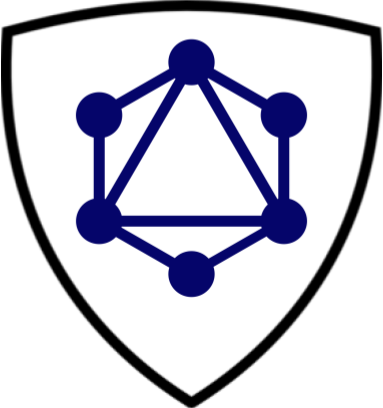
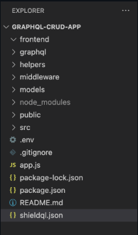

<h1 align="center">
  
  <br>ShieldQL 🛡️</br>
</h1>

ShieldQL is a lightweight, powerful, easy-to-use JavaScript library for GraphQL that adds authentication, authorization, and query sanitization to prevent malicious queries and injection attacks.

- **Authentication:** ShieldQL helps you implement user authentication in your GraphQL APIs, ensuring that only authenticated users can access certain parts of your API.
- **Authorization:** With ShieldQL, you can define granular access controls for different types and fields in your GraphQL schema. This way, you can control what data each user can access based on their role and permissions.
- **Query Sanitization:** ShieldQL gives you the tools to sanitize incoming GraphQL queries to prevent potential malicious operations and protect your backend from excessively deep and excessively long queries used in denial-of-service attacks.

## Features

- **shieldqlConfig:** A Javascript function that allows you to configure sanitizeQuery parameters and creates a secret for each role in the shieldql.json file, storing all of this information in the .env file and the process.env object

  - Where to use: Recommended use is next to importation of ShieldQL functionality in main server file (similar to dotenv.config())
  - shieldqlConfig accepts 3 params: strictShieldQL (a boolean), maxDepthShieldQL (a number), and maxLengthShieldQL (a number), which are used to configure sanitizeQuery (see sanitizeQuery for more details)
    - strictShieldQL: (default false) boolean value that determines whether or not sanitizeQuery will be run on strict mode or not
    - maxDepthShieldQL: (default 10) number that establishes the upper bound for the maximum depth of a graphQL query
    - maxLengthShieldQL: (default 2000) number that establishes the upper bound for total characters in a graphQL query

- **loginLink:** Express middleware function that authenticates the client, creates a jwt access token, and stores it as a cookie on the client's browser to authorize future graphQL queries and mutations aligned with the user's role-based permissions described in the shieldql.json file

  - NOTE: Access token expires after one day

- **validateUser:** Express middleware function that verifies that the client making a graphQL query or mutation is authorized to do so through jwt verification

  - Assumes that res.locals.role has already been populated with the user's role (that matches roles defined in the shieldql.json file) by a previous middleware function

- **sanitizeQuery:** Express middleware function users will require and invoke in their applications to sanitize graphQL queries

  - sanitizeQuery works even if shieldqlConfig is never invoked, although if used without shieldqlConfig, default parameters will be used (strictmode set to false, maxDepth set to 10, maxLength set to 2000)

- **sanitize:** Pure function users can require and invoke in their applications to sanitize the passed-in query.
  - Accepts 4 params:
    - input (required, a graphQL query type string)
    - strict (a bool value, default false, that enables additional query sanitization)
    - maxDepth (the maximum query nesting depth permitted, type integer)
    - maxLength (maximum permitted query length, type integer) that
  - Can be used as a standalone function and is also invoked within the body of the sanitizeQuery function

## Setup

- Make sure dotenv has been imported, that it is properly configured, and that a .env file already exists
- Ensure that the .env file is in the root directory



- Create a shieldql.json file in root directory. This file will define the roles and permissions that will be enforced throughout the user's graphQL application.
  - E.g.:

```javascript
{
  "admin": {
    "query": ["."],
    "mutation": ["."]
  },
  "user": {
    "query": ["feed", "news"]
  },
  "job-applicant": {
    "query": ["job-description"]
  }
}
```

- Ensure that the appropriate graphQL role from the shieldqlConfig.js file is passed into the graphQL route through **res.locals.role** in order for validateToken and loginLink to enforce authentication and authorization

  - This will be passed on to each of ShieldQL's middleware functions
  - A common approach to this problem is the following (see below for an example)

    - Insert a middleware function preceding validateToken and loginLink that queries the user database
    - Extracts the graphQL role
    - Stores it in **res.locals.role**

```javascript
const express = require('express');
const graphqlHttp = require('express-graphql');

const shieldql = require('shieldql');
const dotenv = require('dotenv');
dotenv.config();
shieldql.shieldqlConfig(true, 15, 5000);

const app = express();

app.post(
  '/graphql',
  shieldql.sanitizeQuery,
  populateResLocalsRole, // populateResLocalsRole is an Express Middleware function that populates res.locals.role with the user's graphql.json role
  shieldql.loginLink,
  shieldql.validateUser,
  graphqlHttp({
    schema: graphQlSchema,
    rootValue: graphQlResolvers,
    graphiql: true,
  })
);
```

- NOTE: ShieldQL will NOT be able to authenticate and authorize graphQL queries unless roles are passed into loginLink and validateUser through **res.locals.role** :shipit:

## Installation

```javascript
npm i shieldql
```

## Security Considerations

While ShieldQL offers essential security features, it's crucial to keep your application and dependencies up to date to stay protected against emerging security threats. Always follow best practices for securing your GraphQL APIs.

## Future direction

- allowListing configuration and implementation for sanitize.js
- Amount limiting (limiting number of times a query can be called)
- Jest/End-to-end Testing
- Add error handling for GraphQL queries
- Developing a graphical interface for configuring permissions and user roles
- Integrate a database to restrict malicious query runs.
- Typescript

## Contribution guidelines

We welcome contributions to ShieldQL!

Following Meta's lead with React, we have adopted the [Contributor Covenant](https://www.contributor-covenant.org/) as our code of conduct for future contributors. Please read it to ensure that you understand and accept the terms and conditions described therein.

### Branch management

- Please submit any pull requests to the dev branch. All changes will be reviewed before merging by [OSLabs](https://www.opensourcelabs.io/) and prior contributors.

### Bugs and suggestions

- For help with existing issues, please read our [GitHub issues page](https://github.com/oslabs-beta/ShieldQL/issues)
- If you cannot find support in the issues page, please file a report on the same issues page.
- Suggestions and other feedback are more than welcome!

## Contributors

- **Rodrigo S. Calderon**
  - [LinkedIn](https://www.linkedin.com/in/rodrigosamourcalderon/)
  - [GitHub](https://github.com/rscalderon)
- **Simran Kaur**
  - [LinkedIn](https://www.linkedin.com/in/simran-kaur-nyc/)
  - [GitHub](https://github.com/simk209)
- **Xin Jin Qiu**
  - [LinkedIn](https://www.linkedin.com/in/xinjinqiu/)
  - [GitHub](https://github.com/xjqiu28)
- **Siful Siddiki**
  - [LinkedIn](https://www.linkedin.com/in/siful-siddiki/)
  - [GitHub](https://github.com/sifulsidd)
- **Joie Zhang**
  - [LinkedIn](https://www.linkedin.com/in/joie-zhang/)
  - [GitHub](https://github.com/joie-zhang)

## License

Inspired by [graphQLock](https://github.com/oslabs-beta/graphQLock). _ShieldQL is ISC licensed_

Thank you for using ShieldQL! We hope this library helps you secure your GraphQL APIs effectively. If you encounter any issues or need further assistance, please don't hesitate to reach out to us.

Happy coding!

<!-- # PENDING REVIEW

ShieldQL is a powerful and easy-to-use JavaScript GraphQL middleware library designed to enhance the security of your GraphQL APIs. It provides essential features such as user authentication, authorization, and query sanitization, making it a reliable choice for securing your GraphQL endpoints. With ShieldQL, you can rest assured that your GraphQL API is protected from common security vulnerabilities.

Features
User Authentication: ShieldQL helps you implement user authentication in your GraphQL APIs, ensuring that only authenticated users can access certain parts of your API.

User Authorization: With ShieldQL, you can define granular access controls for different types and fields in your GraphQL schema. This way, you can control what data each user can access based on their role and permissions.

Query Sanitization: ShieldQL automatically sanitizes incoming GraphQL queries to prevent potential malicious operations and protect your backend from harmful attacks like N+1 queries and denial-of-service attacks.

Lightweight and Easy to Use: ShieldQL is designed to be lightweight and straightforward to integrate into your existing GraphQL Express application without introducing unnecessary complexities.


Getting Started
Integrating ShieldQL into your GraphQL Express application is a breeze. Follow these steps to get started:

First, install the ShieldQL package as shown in the installation instructions above.

Import ShieldQL into your Express server file:

Remember to adapt the isAuthenticated and hasPermission functions according to your user authentication and authorization mechanisms.

Security Considerations
While ShieldQL offers essential security features, it's crucial to keep your application and dependencies up to date to stay protected against emerging security threats. Always follow best practices for securing your GraphQL APIs, such as input validation and error handling.
